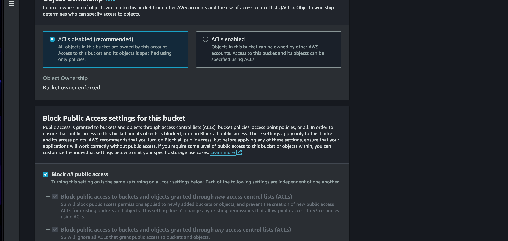
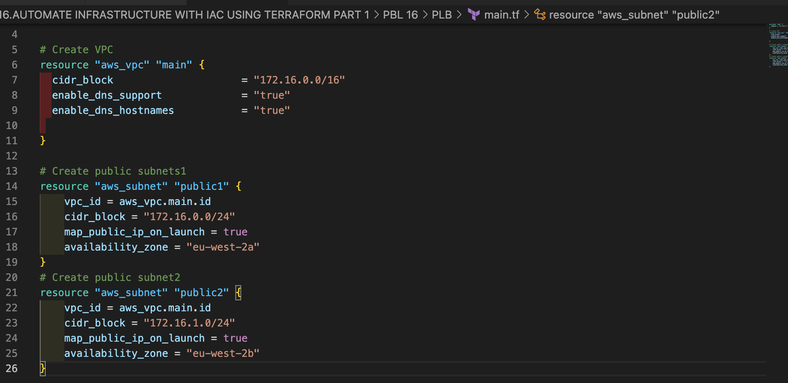

# Using Terraform IAC Tool Automate AWS Cloud Solution for 2 Company Websites - Part 1

In this project, I will be automating the AWS infrastructure for 2 websites that I manually created in Project-15 using Terraform.

**BENEFITS:**

The benefits of using Terraform in this Project include:

- **Improved collaboration:** It allows teams to define and manage infrastructure using version control, which makes it easier for multiple people to collaborate and work on the same codebase. This can help improve collaboration and reduce the risk of errors - This is implemented in Project-18 and Project-19.

- **Version history:** It automatically maintains a version history of your infrastructure, which makes it easy to roll back to previous versions if necessary. This can help protect against mistakes and ensure that you can recover from failures quickly..

- **Consistency:** It allows you to define your infrastructure using a high-level configuration language, which means that you can specify the desired state of your infrastructure in a consistent and predictable way.

- **Reusability:** It allows you to define infrastructure as modular components, which can be easily reused across multiple deployments. This can help reduce duplication and make it easier to manage your infrastructure at scale - This is implemented in Project-18.

- **Portable across cloud providers:** It is portable across different cloud providers, which means that you can use the same tools and processes to manage your infrastructure regardless of where it is deployed.

Overall, Terraform offers a number of benefits for managing infrastructure as code. It has become a mandatory tool to set up reproducible multi-cloud infrastructure.


**Prerequisites:**

- AWS account;
- AWS Identify and Access Management (IAM) credentials and programmatic access.
- Set up AWS credentials locally with `aws configure` in the **AWS Command Line Interface (CLI)**. Click [here](https://github.com/dybran/AWS-Lift-and-Shift-Project/blob/main/AWS-Lift-and-Shift-Project.md)

To write quality Terraform codes, we need to:

- Understand the goal of the desired infrastructure.
- Ability to effectively use up to date Terraform documentation. Click [here](https://registry.terraform.io/)

The resources to be created include:

- S3 buket
- A VPC
- 2 Public subnets

### Create an IAM user

Name it terraform (ensure that the user has only programatic access to your AWS account) and grant this user AdministratorAccess permissions.
- go to IAM user > users > create user


- username : terraform


- give Admnistrator access > create user
 
 
 
 

- click on the new created user terraform from the user 


    
- click on security credentials >  Command Line Interface (CLI) > create


    


    
### The next thing is to configure our aws with security credentials we created

- first make sure you have aws CLI install, if not [download and install](https://docs.aws.amazon.com/cli/latest/userguide/getting-started-install.html)
- go to the command prompt
```
aws config
```
- enter the Access key and Secret Access when prompted


    
- check if the profile has been set by your configuration
- type the command below on the command prompt
```
aws sts get-caller-identity
```   


### Create an S3 bucket to store Terraform state file.
    
- go to S3 > create bucket
- name: ola-dev-terraform-bucket
- region- chooose uk


- block all public asset by default



- bucket versioning : enabled


- create


- check the S3 bucket you created from console :aws s3 ls


# creating VPC|SUBNETS|SECURITY GROUP

- create a directory and name it PLB
- create a file in it and named it main.tf


# Provider and VPC resource section
    - Add AWS as a provider, and a resource to create a VPC in the main.tf file.
    - Provider block informs Terraform that we intend to build infrastructure within AWS.
    - Resource block will create a VPC.

- paste the following code in your terraform maint.tf
provider "aws" {
region = "eu-west-2"
    }
# Create VPC
resource "aws_vpc" "main" {
cidr_block = "172.16.0.0/16"
enable_dns_support = "true"
enable_dns_hostnames = "true"
enable_classiclink = "true" 
enable_classiclink_dns_support = "false"
}


- change to PBL directory and run terraform init


- terraform plan > terraform apply


# go to the aws console and check if the VPC has been created 


# Subnets resource section
According to our architectural design, we require 6 subnets:
- 2 public
- 2 private for webservers
- 2 private for data layer
Let us create the first 2 public subnets.
Add below configuration to the main.tf file:


# Create public subnets1
resource "aws_subnet" "public1" { 
    vpc_id = aws_vpc.main.id 
    cidr_block = "172.16.0.0/24" 
    map_public_ip_on_launch = true 
    availability_zone = "eu-west-2a"
}
# Create public subnet2
resource "aws_subnet" "public2" { 
    vpc_id = aws_vpc.main.id 
    cidr_block = "172.16.1.0/24" 
    map_public_ip_on_launch = true 
    availability_zone = "eu-west-2b"
}



- run terraform fmt to format the code (arrange)
- run terrraform plan and apply


- go to the aws console and check if the subnet were created successfully


- Destroy the resources using: terraform destroy
 

# Fixing The Problems By Code Refactoring

Fixing Hard Coded Values: We will introduce variables, and remove hard coding.
o Starting with the provider block, declare a variable named region, give it a default value, and update
the provider section by referring to the declared variable. 

    variable "region" {
        default = "eu-west-2"
    }

    provider "aws" {
        region = var.region
    }

Do the same to cidr value in the vpc block, and all the other arguments.
  

    variable "vpc_cidr" {
        default = "172.16.0.0/16"
    }

    variable "enable_dns_support" {
        default = "true"
    }

    variable "enable_dns_hostnames" {
        default ="true" 
    }

   


# Fixing multiple resource blocks: This is where things become a little tricky. It’s not complex, we are just
going to introduce some interesting concepts. Loops & Data sources
- Let us fetch Availability zones from AWS, and replace the hard coded value in the subnet’s availability_zone section.

# Get list of availability zones
data "aws_availability_zones" "available" {
    state = "available"
}


# To make use of this new data resource, we will need to introduce a count argument in the subnet block: Something like this.
# Create public subnet1
resource "aws_subnet" "public" { 
    count                   = 2
    vpc_id                  = aws_vpc.main.id
    cidr_block              = "172.16.1.0/24"
    map_public_ip_on_launch = true
    availability_zone       = data.aws_availability_zones.available.names[count.index]

}


# But we still have a problem. If we run Terraform with this configuration, it may succeed for the first time, but by the time it goes into the second loop, it will fail because we still have cidr_block hard coded. The same cidr_block cannot be created twice within the same VPC. So, we have a little more work to do.
  # Create public subnet1
  # Its parameters are cidrsubnet(prefix, newbits, netnum)

- The prefix parameter must be given in CIDR notation, same as for VPC.
- The newbits parameter is the number of additional bits with which to extend the prefix. For example, if given a prefix ending with /16 and a newbits value of 4, the resulting subnet address will have length /20
- The netnum parameter is a whole number that can be represented as a binary integer with no more than newbits binary digits, which will be used to populate the additional bits added to the prefix

  resource "aws_subnet" "public" { 
      count                   = 2
      vpc_id                  = aws_vpc.main.id
      cidr_block              = cidrsubnet(var.vpc_cidr, 4 , count.index)
      map_public_ip_on_launch = true
      availability_zone       = data.aws_availability_zones.available.names[count.index]

  }

  

# The final problem to solve is removing hard coded count value.
If we cannot hard code a value we want, then we will need a way to dynamically provide the value based on some input. Since the data resource returns all the AZs within a region, it makes sense to count the number of AZs returned and pass that number to the count argument.
To do this, we can introuduce length() function, which basically determines the length of a given list, map, or string.
Since data.aws_availability_zones.available.names returns a list like ["eu-central-1a", "eu-central-1b", "eu-central- 1c"] we can pass it into a lenght function and get number of the AZs.
length(["eu-central-1a", "eu-central-1b", "eu-central-1c"])

# Create public subnet1
resource "aws_subnet" "public" { 
    count                   = length(data.aws_availability_zones.available.names)
    vpc_id                  = aws_vpc.main.id
    cidr_block              = cidrsubnet(var.vpc_cidr, 4 , count.index)
    map_public_ip_on_launch = true
    availability_zone       = data.aws_availability_zones.available.names[count.index]

}


# Observations:

What we have now, is sufficient to create the subnet resource required. But if you observe, it is not satisfying our business requirement of just 2 subnets. The length function will return number 3 to the count argument, but what we actually need is 2. Now, let us fix this.

Declare a variable to store the desired number of public subnets, and set the default value

variable "preferred_number_of_public_subnets" {
  default = 2
}


# Next, update the count argument with a condition. Terraform needs to check first if there is a desired number of subnets. Otherwise, use the data returned by the lenght function. See how that is presented below.
# we will ternary operator to solve this : it works this way
    - if the sentence is correct; use the first answer that follows the ? signs
    - if the sentence is not correct; use the answer that follows the semi colon sign(:)
    - and since our var.preferred_number_of_public_subnets :==(not equal to) null
    - the count wil take the number of our default preferred_number_of_public_subnets which is equal to 2 and pass it as the length of returned data.aws_availability_zones.available.names


# Create public subnets
resource "aws_subnet" "public" {
  count  = var.preferred_number_of_public_subnets == null ? length(data.aws_availability_zones.available.names) : var.preferred_number_of_public_subnets   
  vpc_id = aws_vpc.main.id
  cidr_block              = cidrsubnet(var.vpc_cidr, 4 , count.index)
  map_public_ip_on_launch = true
  availability_zone       = data.aws_availability_zones.available.names[count.index]

}


=========================================================================================
# Now the entire configuration should now look like this
# Get list of availability zones
data "aws_availability_zones" "available" {
state = "available"
}

variable "region" {
      default = "us-east-1"
}

variable "vpc_cidr" {
    default = "172.16.0.0/16"
}

variable "enable_dns_support" {
    default = "true"
}

variable "enable_dns_hostnames" {
    default ="true" 
}


  variable "preferred_number_of_public_subnets" {
      default = 2
}

provider "aws" {
  region = var.region
}

# Create VPC
resource "aws_vpc" "main" {
  cidr_block                     = var.vpc_cidr
  enable_dns_support             = var.enable_dns_support 
  enable_dns_hostnames           = var.enable_dns_support

}

# Create public subnets
resource "aws_subnet" "public" {
  count  = var.preferred_number_of_public_subnets == null ? length(data.aws_availability_zones.available.names) : var.preferred_number_of_public_subnets   
  vpc_id = aws_vpc.main.id
  cidr_block              = cidrsubnet(var.vpc_cidr, 4 , count.index)
  map_public_ip_on_launch = true
  availability_zone       = data.aws_availability_zones.available.names[count.index]

}


 - Run terraform fmt, init, plan and apply


- check the aws console if the resources were created sucessfully


=============================================================================================================

# Introducing variables.tf & terraform.tfvars
- We will put all variable declarations in a separate file and provide non default values to each of them
    - Create a new file and name it variables.tf
    - Copy all the variable declarations into the new file.
    - Create another file, name it terraform.tfvars
    - Set values for each of the variables in the terraform.tfvars

# Maint.tf
+++++++++++++++++++++++++++++++++++++++++++++++++++++++++++++++++++++++++++
# Get list of availability zones
data "aws_availability_zones" "available" {
state = "available"
}

provider "aws" {
  region = var.region
}

# Create VPC
resource "aws_vpc" "main" {
  cidr_block                     = var.vpc_cidr
  enable_dns_support             = var.enable_dns_support 
  enable_dns_hostnames           = var.enable_dns_support
  enable_classiclink             = var.enable_classiclink
  enable_classiclink_dns_support = var.enable_classiclink

}

# Create public subnets
resource "aws_subnet" "public" {
  count  = var.preferred_number_of_public_subnets == null ? length(data.aws_availability_zones.available.names) : var.preferred_number_of_public_subnets   
  vpc_id = aws_vpc.main.id
  cidr_block              = cidrsubnet(var.vpc_cidr, 8 , count.index)
  map_public_ip_on_launch = true
  availability_zone       = data.aws_availability_zones.available.names[count.index]
  
}


# variables.tf
+++++++++++++++++++++++++++++++++++++++++++++++++++++++++++++++++++++++++++++++++++++++++++++++
variable "region" {
      default = "us-west-2"
}

variable "vpc_cidr" {
    default = "172.16.0.0/16"
}

variable "enable_dns_support" {
    default = "true"
}

variable "enable_dns_hostnames" {
    default ="true" 
}

  variable "preferred_number_of_public_subnets" {
    type        = number
    description = "Number of private subnets"
}


# terraform.tfvars
+++++++++++++++++++++++++++++++++++++++++++++++++++++++++++++++++++++++++++++++++++++++++
region = "us-west-2"

vpc_cidr = "172.16.0.0/16" 

enable_dns_support = "true" 

enable_dns_hostnames = "true"  

preferred_number_of_public_subnets = 2


- check the aws console to see if the resources were created sucessfully


# you can use terraform apply --auto-approve if you don't want to be typing yes 


1. VPC
2. Subnets
3. internet gateway
3. Elastic IP (depend on internet gateway)
4. Nat gateway (depend on IP, Internet gateway )
5. Route table 
6. Route
7. create a certificate from certificate manager before Route table
8. create security group before the ALB
    - for the reverse proxy, you only specify security group for egress which is outband
    - you can now create a aws security group rule and attached it the security groupid 
    - we need security group rule when we want to referencing another security group group rule
9. Application Load balancer
10. Target Group
11. IaM and Roles (Create AssumeRole)
12. create Launch template (must be existing before Auto G) and
13. Autoscaling group
    13.1. bastion.sh
    13.2. nginx.sh
    13.3. tooling.sh
    13.4. wordpress.sh
    
14. Elastic File system 

